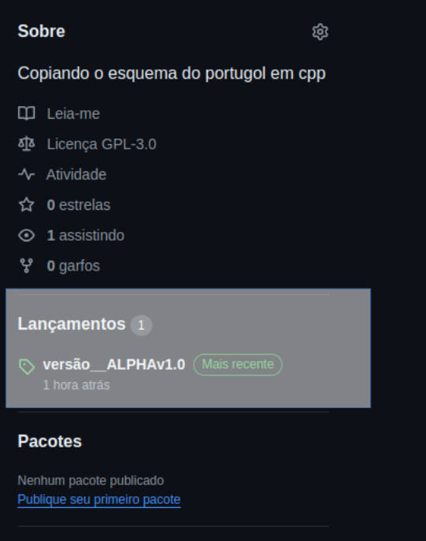

# Biblioteca em C++ copiando o PortugolWeb e Python
<p>
	Esta biblioteca foi criada com o objetivo de facilitar o aprendizado de quem passou do pseudocódigo direto para o C++.
</p>

<p>
	Trazendo muitas funcionalidades básicas em PT/BR e simplificando funções como <apre><code>std::cout;</code></apre> para <apre><code>escreva();</code></apre>.
</p>

## AVISOS:
- Esta biblioteca é recomendada para C++17 ou superior.
- Ela ainda está em desenvolvimento, então pode haver erros.

***
## VERSÕES
#### Cada versão tira um grupo dessas funcionalidades apresentadas abaixo, pois essa lib foi feita pensando em alguém com dificuldades de passar do portugol para o cpp.

### Versão main
- Todas as funcionalidades

### Versão 2
- Sem tradução de tipos de váriaveis

### Versão 3
- Sem tradução de tipos de váriaveis
- Sem tradução das estruturas de controle

### Versão 4
- Sem tradução de tipos de váriaveis
- Sem tradução das estruturas de controle
- Sem funcionalidades I/O

***

## Como usar a lib?:
###	A forma mais simples de usar a lib é:

Ir no repositório da biblioteca e clicar em Release/versões:.



E baixar a versão mais recente do `intuitivLanguage.hpp`.

Quando terminar de baixar, você deve mover o arquivo baixado para o diretório onde está o projeto em que você está trabalhando.

No seu **"*.cpp"**, você deve incluir o **"*.hpp"**. Pronto, já pode usar todas as funcionalidades da biblioteca.

---
## INCLUDES
#### Essa lib já deixa algumas libs standarts já incluidas automaticamente.

### São elas:
- iostream
- sstream
- string
- vector
- array
- map

---
## TRADUÇÕES: 
### Tipos de variáveis:

| original | lib |
| ----------- | ----------- |
| int | inteiro |
| short | pequeno |
| long | longo |
| float | real |
| double | duplo |
| char | caracter |
| std::string | cadeia |
| bool | boleano |

#### Esse é um exemplo de todos os tipos:
```
#include "mainComplet/intutivLanguage.hpp"

inteiro main() {
  inteiro a{830};
  pequeno b{230};
  longo c{1000000};
  real d{1500.55};
  duplo e{15000055.2345};
  caracter f{'a'};
  cadeia g{"Hello World"};
  boleano h{true};

  escreva(a, " ", b, " ", c, " ", d, " ", e, " ", f, " ", g, " ", h, '\n');

  return 0;
}

```

***

### Estruturas de controle:

#### Desvios condicionais:

| original | lib |
| ----------- | ----------- |
| **Desvios condicionais** |
| if | se |
| else | senao |
| switch | escolha |
| case | caso |
| default | casocontrario |
| **Laços de repetição** |
| while | enquanto |
| for | para |

##### Exemplo de desvios condicionais:

```
#include "mainComplet/intutivLanguage.hpp"

inteiro main() {
  se(true) {
    escreva("\n\tHello World\n");
  }
  senao {
    escreva("Caso contrario / Senão");
  }

  inteiro a = 3;

  switch (a) {
    caso 1 : pare;
    caso 2 : pare;
    caso 3 : escreva("\tHello World\n");
    pare;
  casocontrario:
    pare;
  }

  return 0;
}

```

##### Exemplo de laços de repetição:

```
#include "mainComplet/intutivLanguage.hpp"

inteiro main() {
  boleano condition = true;

  enquato(condition) {
    leia("\n\tQual condition?\t", condition);
  }

  para(inteiro i = 0; i < 10; ++i) {
    escreva(i, '\n');
  }

  escreva('\n', '\t', "Fim\n", condition, '\n');

  return 0;
}
```

***

##### Exemplo de
### estruturas de recorrência:

| original | lib |
| ----------- | ----------- |
| return | retorne |
| continue | continua |
| break | pare |


Essas estruturas não necessitam de exemplos, pois só mudam o nome:

**return** == retornar um valor de uma função;
**continue** == Continua na linha 1 do código do laço de repetição;
**break** == Para uma repetição;

***

## Funções:

### escreva:

A função escreva tenta ser o mais intuitiva possível, podendo escrever qualquer tipo de valor sem usar máscara ou tipo.

#### EX:

```
#include "mainComplet/intutivLanguage.hpp"

inteiro main() {
  inteiro a{830};
  pequeno b{230};
  longo c{1000000};
  real d{1500.55};
  duplo e{15000055.2345};
  caracter f{'a'};
  cadeia g{"Hello World"};
  boleano h{true};

  escreva(a, " ", b, " ", c, " ", d, " ", e, " ", f, " ", g, " ", h, '\n');

  return 0;
}
```


Nesse exemplo, você pode ver que são vários parâmetros que não importa o tipo, sendo que se quiser adicionar algo como uma cadeia e um booleano, só precisa usar uma vírgula entre os dois.

### leia:

A função leia serve para escrever algo e guardar na variável que você deixou como segundo parâmetro.

#### EX:

```
#include "mainComplet/intutivLanguage.hpp"

inteiro main() {
  boleano condition = true;

  enquato(condition) {
    leia("\n\tQual condition?\t", condition);
  }
}
```

Nesse exemplo, você pode ver que o primeiro parâmetro é a mensagem, sendo que se você não quiser colocar uma pré-mensagem, é só deixar assim: `""`. No segundo parâmetro, você coloca a variável que vai guardar a mensagem recebida pelo cliente. Pode ser qualquer tipo de variável.

##### OBS:.

Na leitura, automaticamente já aceita vários tipos de mensagens para o booleano. Essas são as mensagens aceitas:

| verdadeiro | falso |
| ----------- | ------------ |
| 1 | 0 |
| true | false |
| True | False |
| TRUE | FALSE |
| verdadeiro | falso |
| Verdadeiro | Falso |
| VERDADEIRO | FALSO |
| verdade | mentira |
| Verdade | Mentira |
| VERDADE | MENTIRA |
| sim | nâo |
| Sim | Não |
| SIM | NÃO |
|| nao |
|| Nao |
|| NAO |

Em um dos exemplos acima, a resposta no terminal é algo semelhante a isso:

```
	Qual condition?	1

	Qual condition?	true

	Qual condition?	TRUE

	Qual condition?	verdadeiro

	Qual condition?	VERDADEIRO

	Qual condition?	VERDADE

	Qual condition?	sim

	Qual condition?	SIM

	Qual condition?	falso

```
